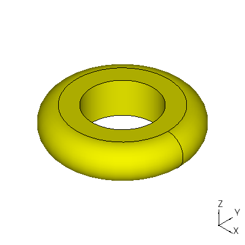
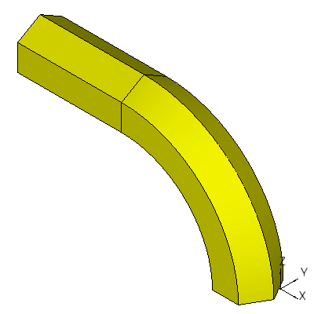
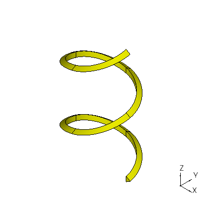
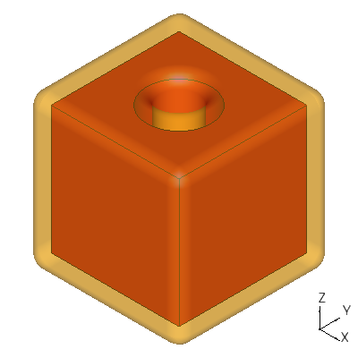

Creating Derived Shapes
=======================

Some shapes are derived from others and create arbitrary shapes,
depending on what's passed to them.  They follow.

prism
-----

A prism extrudes a shape in a given linear direction.  A vertex is
extruded as an edge; an edge is extruded as a face; a wire is extruded
as a shell; and a face is extruded as a solid.  The following example
creates an extrusion of a hexagon::

  f1 = ccad.plane(ccad.ngon(2.0, 6))
  s1 = ccad.prism(f1, (0.0, 0.0, 1.0))

.. image:: derived_prism.png

revol
-----

A revol extrudes a shape in a circle.  A vertex is extruded as an
edge; an edge is extruded as a face; a wire is extruded as a shell;
and a face is extruded as a solid.  The following example extrudes a
squared circle about (0.0, 0.0, 0.0)::

  e1 = ccad.arc(1.0, -math.pi/2, math.pi/2)
  e1.translate((3.0, 0.0, 0.0))
  w1 = ccad.polygon([(3.0, 1.0, 0.0),
                     (2.0, 1.0, 0.0),
                     (2.0, -1.0, 0.0),
                     (3.0, -1.0, 0.0)])
  f1 = ccad.plane(ccad.wire([e1, w1]))
  s1 = ccad.revol(f1, (0.0, 0.0, 0.0), (0.0, 0.0, 1.0), 2*math.pi)

loft
----

A loft returns a solid or shell that fits a list of closed wires.  The
following example fits a changing-diameter circle::

  w1 = ccad.wire([ccad.circle(1.0)])
  w2 = ccad.wire([ccad.circle(2.0)])
  w2.translate((0.0, 0.0, 1.0))
  w3 = ccad.wire([ccad.circle(1.5)])
  w3.translate((0.0, 0.0, 2.0))
  s1 = ccad.loft([w1, w2, w3], stype = 'solid')

.. image:: derived_loft.png

pipe
----

A pipe returns a solid or shell that is an extrusion of a closed wire
profile along a wire spine.  The following example extrudes a hexagon
along an arching and then straight spine::

  profile = ccad.ngon(2.0, 6)
  e1 = ccad.arc(8.0, 0.0, math.pi/2)
  e2 = ccad.segment((0.0, 8.0, 0.0), (-8.0, 8.0, 0.0))
  spine = ccad.wire([e1, e2])
  spine.translate((-8.0, 0.0, 0.0))
  spine.rotatex(math.pi/2)
  s1 = ccad.pipe(profile, spine)

helical_solid
-------------

A helical_solid is a pipe spun on a helical spine.  Unfortunately,
pipe had trouble with the profile's orientation on a helix, so
helical_solid was needed.  The following example extrudes a triangle
along a helix::

  profile = ccad.ngon(0.2, 3)
  s1 = ccad.helical_solid(profile, 2.0, 1.0/math.pi, 2)

offset
------

offset offsets a face or solid by a given distance and returns a list
of faces or solids.  Why doesn't it return a single face or solid?
Depending on the distance, offsetting can create multiple shapes from
one.  For example, consider a 2D version of an octopus.  As offset
gets larger and larger, parts of the face merge and can create holes.
The following example offsets a hexagon by 1.0.  In this example, the
returned list is only one item long::

  w1 = ccad.ngon(8.0, 6)
  w2 = ccad.offset(ccad.plane(w1), 1.0)[0]

.. image:: derived_offset_face.png

The following example offsets a box with a hole by 1.0.  In this
example, the returned list is only one item long::

  b1 = ccad.box(10.0, 10.0, 10.0)
  b1.translate((-5.0, -5.0, 0.0))
  c1 = ccad.cylinder(2.5, 20.0)
  c1.translate((0.0, 0.0, -5.0))
  s1 = b1 - c1
  s2 = ccad.offset(s1, 1.0)[0]

Note the offset shape has edges rounded.  Currently, this is the only
option OCC provides.

A positive value for offset makes the new face or solid outside the
original.  A negative value makes the new face or solid inside the
original.

slice
-----

slice slices a solid with a plane and returns a list of faces at the
intersection of the solid and plane.  The plane can be passed or a
value for x, y, or z can be given which generates the plane.  The
following example slices a box with a hole at z = 1.0::

  b1 = ccad.box(10.0, 10.0, 10.0)
  b1.translate((-5.0, -5.0, 0.0))
  c1 = ccad.cylinder(2.5, 20.0)
  c1.translate((0.0, 0.0, -5.0))
  s1 = b1 - c1
  f1 = ccad.slice(s1, z = 1.0)[0]

.. image:: derived_slice.png

