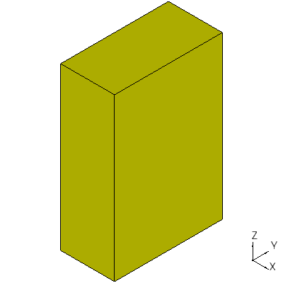
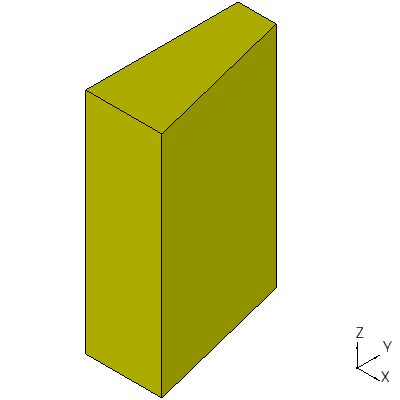
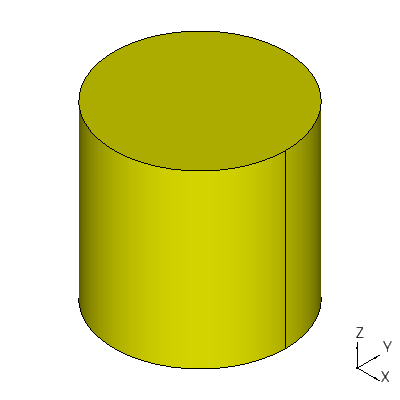
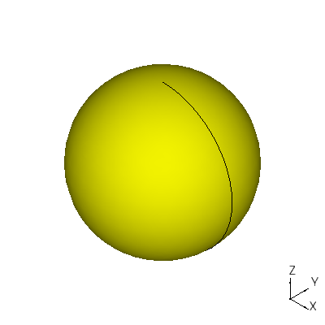
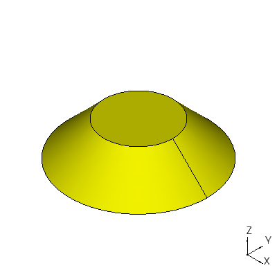

Creating Solids
===============

Functions that instantiate a solid follow.  In each example, the solid
is called **s1**.

box
---

A box is a six-sided perpendicular-faced solid.  The following example
creates a box that extends 1.0 in the x-direction, 2.0 in the
y-direction, and 3.0 in the z-direction::

  s1 = ccad.box(1.0, 2.0, 3.0)

wedge
-----

A wedge is a box with one or more tapered sides.  The following
example creates a wedge that extends 2.0 in the y-direction and 3.0 in
the z-direction and tapers from 1.0 to 0.5 in the x-direction::

  s1 = ccad.wedge(1.0, 2.0, 3.0, 0.5)

cylinder
--------

The following example creates a cylinder 1.0 in radius and 2.0 high::

  s1 = ccad.cylinder(1.0, 2.0)

sphere
------

The following example creates a sphere 5.0 in radius::

  s1 = ccad.sphere(5.0)

cone
----

The following example creates the bottom of a cone, radius 4.0 at the
bottom, 2.0 at the top, and 2.0 high::

  s1 = ccad.cone(4.0, 2.0, 2.0)

A similar function, bezier_cone, returns an identical solid, but the
cone face is a surface of revolution.  Fillets worked better with it
sometimes.

torus
-----

The following example creates a torus 10.0 from torus center to
extruded circle center, and 1.0 in radius::

  s1 = ccad.torus(10.0, 1.0)

.. image:: solid_torus.png

Notes
-----

Many of these functions offer more options than shown.  Consult the
API for details.
