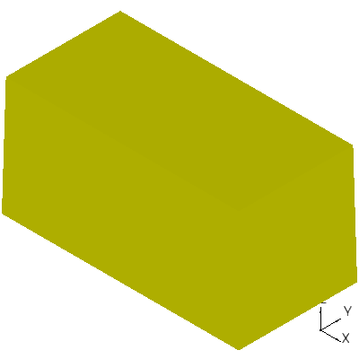
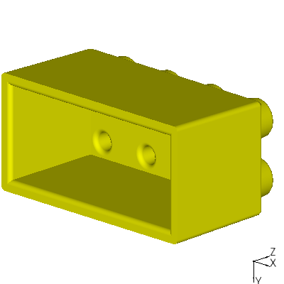
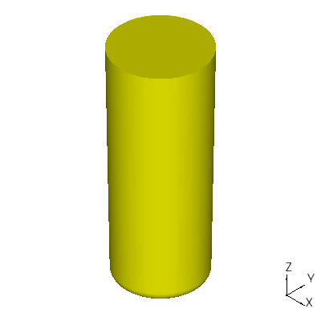

A Single Brick
--------------

First, I'll start by importing the required packages::

  import math
  import ccad

Now, I'll define some dimensions for all bricks::

  unit = 5.0
  height = 10.0
  knob_rad = 1.8 # radius of the brick knob for mating with other bricks
  knob_draft = 5.0 # degrees of draft for the knob
  knob_height = 2.0
  wall_thickness = 1.6 # plastic wall thickness
  draft = 1.0 # degrees of draft on faces for plastic ejection
  fillet_rad = 0.4 # the default radius to use for rounded edges

In ipython, I set up the specific brick's dimensions.  Later, these
will be pass parameters in a function::

  xsize = 4
  ysize = 2

Now, I begin making the outer shape.  I could use **box**, but most
injection molders want you to draft the walls to make machining and
ejection easier.  **loft* tends to be more robust than **draft** on
arbitrary shapes, so I'll use that::

  dx = height * math.tan(math.radians(draft))
  wbottom = ccad.rectangle(unit * xsize, unit * ysize)
  wtop = ccad.rectangle(unit * xsize - 2*dx, unit * ysize - 2*dx)
  wtop.translate((dx, dx, height))
  brick = ccad.loft([wbottom, wtop], True)

  view1 = ccad.view()
  view1.display(brick)

Here, the brick bottom is defined by the wire, **wbottom**, and the
brick top is defined by the wire, **wtop**.  The **loft** with ruled set
to *True* converts the wires to a ruled solid:

I need a knob on top for mating with bricks above, and I want that
knob to aid in alignment by tapering it.  A cone would do nicely::

  drad = knob_height * math.tan(math.radians(knob_draft))
  knob_top_rad = knob_rad - drad
  knob_base_rad = knob_rad + drad
  knob = ccad.cone(knob_base_rad, knob_top_rad, 2 * knob_height)
  knob.translate((0.5 * unit, 0.5 * unit, height - knob_height))

Notice the knob is higher than it needed to be, then offset.  Usually,
boolean operations are less buggy when surfaces don't coincide on
their faces.  That is, make the knob penetrate into the brick for more
robust boolean operations.

Now, I add the knob to the view to make sure I like the position.
It's added in red::

  view1.display(knob, color = (1.0, 0.0, 0.0))

.. image:: example1_boxwknob.png

Now, I'll replicate the knob and fuse it with the brick::

  for x in range(xsize):
      for y in range(ysize):
          brick = brick + ccad.translated(knob, (x * unit, y * unit, 0.0))

  view1.clear()
  view1.display(brick)

.. image:: example1_boxwknobs.png

Note the use of the *function* form of translate here:
**ccad.translated** versus the *method* form for wtop: **wtop.translate**.
I use the function form when I want to *copy* a shape.  I use the
method form when I want to *change* a shape.

Injection molders like same-thickness walls, so I need to core-out the
brick.  At this point, it looks like most of my code can be replicated
for the core, so I'll place the solid brick in its own function and
add a **wall_offset** to its pass parameters and place it in a file
called **brick.py**::

  import ccad
  import math

  def solidbrick(xsize, ysize, wall_offset, unit, height, draft,
                 knob_rad, knob_height, knob_draft):
    
      dx = height * math.tan(math.radians(draft))
      wbottom = ccad.rectangle(unit*xsize - 2*wall_offset,
                               unit*ysize - 2*wall_offset)
      wtop = ccad.rectangle(unit*xsize - 2*dx - 2*wall_offset,
                            unit*ysize - 2*dx - 2*wall_offset)
      wtop.translate((dx, dx, height))
      brick = ccad.loft([wbottom, wtop], True)
      brick.translate((wall_offset, wall_offset, 0.0))

      drad = knob_height * math.tan(math.radians(knob_draft))
      knob_top_rad = knob_rad - drad
      knob_base_rad = knob_rad + drad
      knob = ccad.cone(knob_base_rad, knob_top_rad, 2 * knob_height)
      knob.translate((0.5 * unit, 0.5 * unit, height - knob_height))

      for x in range(xsize):
          for y in range(ysize):
              brick = brick + ccad.translated(knob, (x * unit, y * unit, 0.0))

      return brick

And, I can import it in ipython::

  import brick

  outerbrick = brick.solidbrick(xsize, ysize, 0.0, unit, height, draft,
                                knob_rad, knob_height, knob_draft)

**outerbrick** is now the outside of the brick.

Before I create the inside of the brick, I ought to add fillets to
**outerbrick**.  Many injection molders use milling to form the mold.
Milling requires fillets wherever the ball endmill can't make a sharp
corner.  For the cavity, it's the convex edges.  For the core, it's
the concave edges.  To make things simple, I usually fillet every
edge.  However, to show off some of ccad's features, I'll fillet only
the edges I must fillet.

In outerbrick, I want to fillet the tip of every knob, the side walls,
and the top walls::

  to_fillet = []
  for count, edge_center in enumerate(outerbrick.subcenters('edge')):
      if (abs(edge_center[2]) < 0.1 or
          (abs(edge_center[2] - height) < 0.1 and
           abs(edge_center[0] - 0.5*unit) % unit < 0.1 and
           abs(edge_center[1] - 0.5*unit) % unit < 0.1)):
          pass
      else:
          to_fillet.append(count)
  outerbrick.fillet(fillet_rad, to_fillet)

The loop goes through every edge in **outerbrick**, analyzing the edge's
center.  Edges whose z-component is near zero are not filleted.
Additionally, edges with z-component equal to **height** and
xy-components near the knob positions are not filleted.  All other
edges are filleted.  Here's what I get::

  v.clear()
  v.display(outerbrick)

.. image:: example1_outerbrick.png

With the **solidbrick** function, I can now define the inside of the brick::

  innerbrick = brick.solidbrick(xsize, ysize, wall_thickness,
                                unit, height - wall_thickness, draft,
                                knob_rad - wall_thickness, knob_height,
                                knob_draft)
  base = ccad.box(2*unit*xsize, 2*unit*ysize, 1.0)
  base.translate((-0.5*unit*xsize, -0.5*unit*ysize, -1.0))
  innerbrick = innerbrick + base

  view1.clear()
  view1.display(innerbrick)

.. image:: example1_innerbrick.png

Note, I have added a base to **innerbrick**.  It will be helpful when I
perform the boolean cut.  Finally, I'll fillet **innerbrick**::

  to_fillet = []
  for count, edge_center in enumerate(innerbrick.subcenters('edge')):
      if (abs(edge_center[2]) < 0.1 or
          (abs(edge_center[2] - (height - wall_thickness)) < 0.1 and
           abs(edge_center[0] - 0.5*unit) % unit < 0.1 and
           abs(edge_center[1] - 0.5*unit) % unit < 0.1)):
          to_fillet.append(count)
  innerbrick.fillet(fillet_rad, to_fillet)

  v.clear()
  v.display(innerbrick)

.. image:: example1_innerbrickfillet.png

You should recognize the fillet code.  It's the opposite of the edges
filleted for **outerbrick**, because it's a core.

Finally, I'll perform the cut::

  brick = outerbrick - innerbrick

  v.clear()
  v.set_projection((0.0, 0.0, 0.0),
                   (math.sqrt(0.45), -math.sqrt(0.1), -math.sqrt(0.45)),
		   (0.0, -1.0, 0.0))
  v.display(brick)

I'm almost there.  I now only need the posts that sit between the
knobs to add more holding force.  Like the knobs, I'll make the posts
cones and fillet the tips::

  post_rad = (math.sqrt(2.0)*unit - 2*knob_rad)/2.0
  drad = (height - 0.5*wall_thickness) * math.tan(math.radians(draft))
  post_base_rad = post_rad + drad
  post = ccad.cone(post_rad, post_base_rad, height - 0.5*wall_thickness)
  post.fillet(fillet_rad, [(0.0, 0.0, 0.0)])

Here, I've chosen to pass a list of the center positions of the edges
to be filleted to the fillet method.  In this case, I'm only filleting
one edge, the tip.

Now, I translate it and add it to the brick::

  post.translate((unit/2, unit/2, 0.0))
  for x in range(xsize - 1):
      for y in range(ysize - 1):
          brick = brick + ccad.translated(post, (x * unit, y * unit, 0.0))

.. image:: example1_brickpost.png
