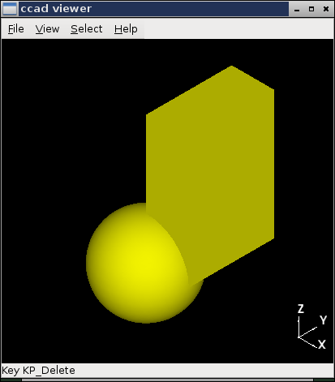

Using Display
=============

View -> Mode
------------

ccad offers three forms of viewing: wireframe, shaded (filled solids),
and hidden line removal.

.. image:: display_wireframe.png

.. image:: display_hlr.png

View -> Side
------------

Various standard views can be selected from the View -> Side menu, or
you can use Blender hotkeys:

  - keypad 7 for top view
  - keypad 1 for front view
  - keypad 3 for right view
  - hold shift with those keys to see the opposite view

View -> Orbit
-------------

Orbiting allows you to orbit around the scene, keeping the scene the
same distance from you.  You can use the menus, you can press the
middle mouse button and move the mouse, or you can use Blender hotkeys:

  - keypad 8 to orbit up
  - keypad 2 to orbit down
  - keypad 4 to orbit left
  - keypad 6 to orbit right

View -> Pan
-----------

Pan allows you to move the center of the scene.  You can use the
menus, you can hold shift while pressing the middle mouse button and
moving the mouse, or you can use Blender hotkeys:

  - shift keypad 8 to pan up
  - shift keypad 2 to pan down
  - shift keypad 4 to pan left
  - shift keypad 6 to pan right

View -> Zoom
------------

You can zoom in or out by using the menus, or using the Blender hotkeys:

  - keypad + to zoom in
  - keypad - to zoom out

Select -> Shape
---------------

In Select -> Shape mode, you select shapes.  Move to the shape you are
interested in, and right click on it.  The shape is selected.  In this
case, shape refers to something you passed to the display function,
not any arbitrary shape.  If you only passed one shape to the display
function, there is only one shape to select.

Select -> Face
--------------

In Select -> Face mode, you can select a face on a shape you selected.
Right click on the face of interest, and you'll see the face index,
type, and center on the status line.

.. image:: select_face.png

Select -> Edge
--------------

In Select -> Edge mode, you can select an edge on a shape you
selected.  Right click on the edge of interest, and you'll see the
edge index and center on the status line.

.. image:: select_edge.png

Edge selection can be very handy when trying to fillet specific edges.
Once you know the edge's coordinates (or even index if the shape won't
change), you can pass those coordinates to the fillet function.

Select -> Vertex
----------------

In Select -> Vertex mode, you can select a vertex on a shape you
selected.  Right click on the vertex of interest, and you'll see the
vertex index and center on the status line.

.. image:: select_vertex.png

  
